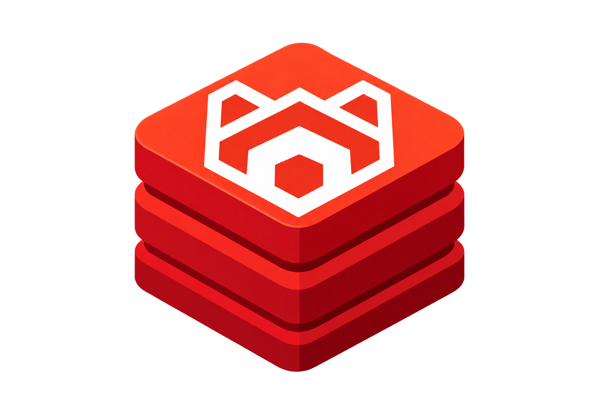

# rpkv

<p align="center"></p>

Key-value reads over Redpanda topics, without duplicating values.

[](https://github.com/sonirico/rpkv/actions/workflows/ci.yml) [](LICENSE) [](go.mod)

## Why

A topic already holds every value; what it cannot answer cheaply is
"latest value for key X". rpkv is a pure-Go sidecar that maintains a
secondary index `key -> (partition, offset)` in embedded Pebble -
pointer-sized entries, regardless of value size - and serves `Get` by
fetching exactly that record from the log over the Kafka protocol
(franz-go). Kafka Streams answers the same question by copying every
value into RocksDB; rpkv makes the opposite trade: space over read
latency, honestly declared.

Sweet spot: big values, modest read rates, on-prem.

The wrong fit: hot read paths or small values. Every read pays a
broker round-trip (11.1 ms p50 measured, see
[Benchmarks](#benchmarks)); if you read far more often than you can
afford that, a value-materializing store is the better trade.

## How it works

```
producers --> Redpanda topic (compacted)
                    |
                    v
             rpkv ingest (franz-go consumer)
                    |
                    v
       Pebble index: key -> (partition, offset)
       + per-partition checkpoints, one atomic batch
                    |
                    v
  HTTP GET /v1/kv/{topic}/{key}
       |
       +--> index lookup --> single-record fetch at the
            exact (partition, offset) from the broker
            --> verified value returned
```

Fetch results are never trusted blindly: they pass a read verification
protocol. If a pointer is superseded by compaction mid-read, rpkv detects
it, re-resolves the key against the advancing checkpoint, and re-fetches -
within a 2s budget - rather than ever serving a stale or wrong value.

## Guarantees

- No value is ever stored, cached or copied by rpkv - the index holds
  pointers and checkpoints, the log holds values.
- The index is a disposable projection - delete the data directory and it
  rebuilds from the log to an identical state.
- Index apply and checkpoint advance commit in one atomic Pebble batch -
  a crash between them is unrepresentable; recovery is resume plus
  idempotent re-apply.
- Only the public Kafka protocol is used, never the broker's data
  directory.

**Proven, not promised.** The compaction contract suite
(`internal/app/compaction_integration_test.go`) produces thousands of
overwrites on an aggressively compacted topic, forces compaction
repeatedly, restarts the process twice over the same index directory, and
asserts every live key returns its latest value byte-identical and every
tombstoned key 404s - black-box, over HTTP, against a real Redpanda.

## Quickstart

Install the dev toolchain and git hooks:

```sh
just setup
```

Start a single-node dev Redpanda on `localhost:19092`:

```sh
just redpanda-up
```

Create the topic before starting rpkv - rpkv fails fast at startup if
an indexed topic does not exist yet. The dev container ships `rpk`, so
no local install is needed:

```sh
docker exec rpkv-redpanda rpk topic create orders
```

Run the binary. Each flag falls back to an environment variable (flag
wins over env):

```sh
go run ./cmd/rpkv \
  --brokers localhost:19092 \
  --topics orders \
  --data-dir ./rpkv-data \
  --listen :8080
```

| Flag | Env fallback | Default |
|---|---|---|
| `--brokers` | `RPKV_BROKERS` | (required) |
| `--topics` | `RPKV_TOPICS` | (required) |
| `--data-dir` | `RPKV_DATA_DIR` | `./rpkv-data` |
| `--listen` | `RPKV_LISTEN` | `:8080` |

Produce a record:

```sh
printf 'hello-value\n' | docker exec -i rpkv-redpanda rpk topic produce orders --key user-42
```

Read it back:

```sh
curl -i http://localhost:8080/v1/kv/orders/user-42
```

```
HTTP/1.1 200 OK
X-Rpkv-Partition: 0
X-Rpkv-Offset: 0
X-Rpkv-Checkpoint: 0

hello-value
```

## HTTP API

`GET /v1/kv/{topic}/{key}` - `{key}` is percent-encoded raw bytes;
`?key_encoding=base64url` accepts RFC 4648 base64url instead.

| Route | Case | Response |
|---|---|---|
| `GET /v1/kv/{topic}/{key}` | Hit | `200`, body = raw value bytes; headers `X-Rpkv-Partition`, `X-Rpkv-Offset`, `X-Rpkv-Checkpoint` |
| `GET /v1/kv/{topic}/{key}` | Key not in index | `404`, empty body |
| `GET /v1/kv/{topic}/{key}` | Evicted by retention | `410` |
| `GET /v1/kv/{topic}/{key}` | Superseded and catch-up did not resolve within budget | `503`, `Retry-After: 1` |
| `GET /v1/kv/{topic}/{key}` | Topic not indexed by this instance | `404` with body `topic not indexed` |
| `GET /healthz` | - | `200` always, JSON body with per-partition checkpoint and log-end lag |
| `GET /metrics` | - | `200`, Prometheus exposition format |

## Metrics

| Metric | Type | Labels |
|---|---|---|
| `rpkv_fetch_outcomes_total` | Counter | `topic`, `outcome` |
| `rpkv_supersede_retries_total` | Counter | none |
| `rpkv_http_request_duration_seconds` | Histogram | none |
| `rpkv_ingest_apply_batch_size` | Histogram | `topic` |
| `rpkv_ingest_null_keys_skipped_total` | Counter | `topic` |
| `rpkv_ingest_lag` | Gauge | `topic`, `partition` |

## Deployment

Replicas are fully independent: each instance consumes the indexed
topics with its own client (direct partition assignment, no consumer
group) and owns a private Pebble index. Horizontal read scaling is N
instances behind a load balancer. Failover and recovery are the same
operation: start a fresh instance and let it rebuild from the log
(~996k keys/s measured), or restart on the same volume and resume
from the checkpoint.

There is no replication protocol and no cross-replica coordination:
two replicas can serve different checkpoints, so there is no
read-your-writes and no monotonic-reads guarantee across instances.
Staleness is per-replica, bounded by ingest lag, and observable as
`rpkv_ingest_lag`. Rationale and accepted costs:
[ADR-008](docs/adr/008-deployment-replication.md).

## Benchmarks

Numbers on record live under [`docs/benchmarks/`](docs/benchmarks/), each
with the command that reproduces it.

| Measurement | Result | Record |
|---|---|---|
| Read latency, local segments (p50 / p99) | 11.1 ms / 16.9 ms | [read-latency.md](docs/benchmarks/read-latency.md) |
| Index rebuild rate | ~996k keys/s | [rebuild-rate.md](docs/benchmarks/rebuild-rate.md) |
| Index size at 10^6 keys | 14.2 bytes/key | [index-size.md](docs/benchmarks/index-size.md) |

Client-observed end-to-end `GET` wall time on loopback against a
single-node dockerized Redpanda, broker fetch round-trip included:
100000 keys of 256 random bytes, 5000 uniform-random reads. Reproduce
with `just bench-read`, `just bench-rebuild` and `just bench-index-size`.
Tiered-storage-evicted read latency is pending an object store (MinIO)
in the test substrate.

## Status

| Phase | State |
|---|---|
| 0 - Foundations | done |
| 1 - Core (index, ingest, fetch, server, cmd, metrics) | done |
| 2 - Resilience proof | done |
| 3 - Numbers and release | done - v0.1.0; tiered-storage-evicted latency remains blocked on an object store in the test substrate |

Measured numbers land under `docs/benchmarks/` with reproduce commands;
see [Benchmarks](#benchmarks) for what is on record so far.

## Development

```sh
just check
```

Runs formatting, `go vet`, a `CGO_ENABLED=0` build, unit tests and the
package-boundary checks.

```sh
just test-integration
```

Runs integration tests against a self-provisioned Redpanda (via `testit`);
requires Docker.

```
index/              Pebble store: key->Pointer, checkpoints, atomic batches
ingest/             topic consumer -> index apply (franz-go)
fetch/              path-A reader: single-record fetch by (partition, offset)
server/             query surface: Get(topic, key) -> value, pointer, checkpoint
clock/              injectable Clock; sole production caller of time.Now/After
metrics/            metrics facade public packages emit through; no implementation
cmd/rpkv/           main: wiring owner, and nothing but wiring
internal/           this binary's flags, env, process glue
docs/benchmarks/    numbers on record, with the commands that reproduce them
```

## License

MIT - see [LICENSE](LICENSE).
